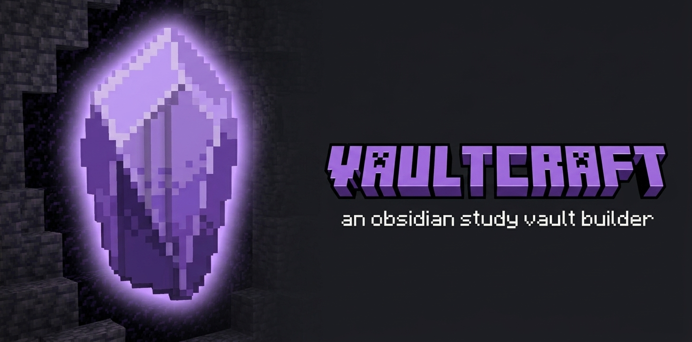
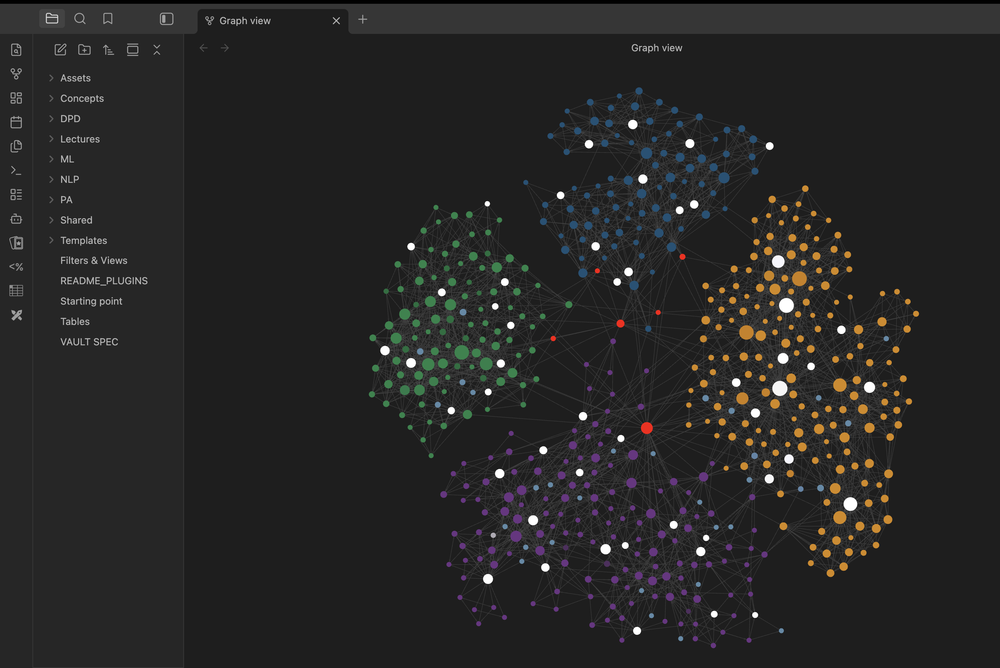
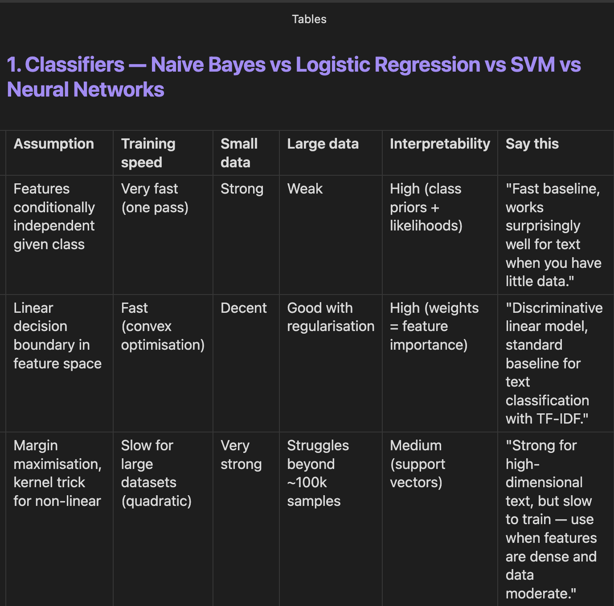

<div align="center">



# vaultcraft

**An obsidian study vault builder.**

[](LICENSE)
[](https://claude.com/claude-code)
[](https://obsidian.md)
[](CONTRIBUTING.md)

A [Claude Code](https://claude.com/claude-code) agent that turns lecture slides, lab notebooks, and textbook PDFs into a navigable, exam-ready [Obsidian](https://obsidian.md) knowledge vault — with hover-visible definitions, ELI5 analogies, comparison tables, and spaced-repetition flashcards.

[Quick start](#installation) · [How to use](#how-to-use) · [Examples](docs/examples.md) · [Conventions](docs/conventions.md) · [Contributing](CONTRIBUTING.md)

</div>

---

## What it does

Point the agent at a folder of course materials. After a 30-minute run on a typical 12-lecture course, you get:

**~150 atomic concept notes**, each ~250–500 words long. One concept per file. Every note opens with a `> [!definition]` callout that Obsidian shows in hover previews — you skim a lecture sheet, hover any wikilink, see the definition without leaving the page.

The agent doesn't bundle related techniques into one note. It splits them:

- *N-gram smoothing* → 6 notes — `Laplace Smoothing`, `Add-k Smoothing`, `Good-Turing`, `Kneser-Ney`, `Linear Interpolation`, `Backoff` — each with its own formula, worked numbers, and tradeoffs
- *Attention* → 6 notes — `Scaled Dot-Product`, `Multi-Head`, `Self-Attention`, `Cross-Attention`, `Masked Attention`, `Sinusoidal Positional Encoding`
- *Word embeddings* → 8+ notes — `Word2Vec`, `CBOW`, `Skip-gram`, `Negative Sampling`, `GloVe`, `FastText`, `Contextual Embeddings`, …

**12 lecture study sheets**, one per session. Each has a TL;DR callout (5 bullets), narrative sections matching the slide deck (~1,500–2,500 words for detailed format), and 8–12 potential exam questions split across four categories: theory, comparison, application, critical thinking.

**9 lab study sheets** if you have Python notebooks. Each lists the key library functions used (`CountVectorizer.fit_transform`, `nltk.word_tokenize`, ...), 3–6 core code patterns with annotations, common gotchas, expected output, and 4–6 exam-style questions.

**A `Tables.md` at vault root** with 5–8 comparison tables — classifiers side-by-side, embeddings side-by-side, smoothing methods side-by-side. Every row has a **"Say this"** column with a one-sentence elevator pitch you can recite verbatim during oral exams.

**~3,000–5,000 wikilinks** holding it all together. Hover preview, `Cmd+O` jump, graph view, backlinks panel — all work out of the box.

**A pre-configured `.obsidian/`** with graph view colours per folder (lectures one colour, concepts another, labs a third), Page Preview plugin enabled, navigation files filtered out of the graph, and CSS snippets for callout styling.

**Hard concepts get an ELI5 section** with a 3–5 sentence analogy using everyday objects. Backpropagation gets explained as a restaurant kitchen passing complaints back through the prep line. Attention is reading a book with a flashlight that also lights up nearby words. Cross-entropy is a weather forecaster being punished extra for confident wrong predictions. Under exam stress, the analogy is what you remember; the formalism reconstructs from there.

The output: a vault you actually want to open at 2 AM the night before an exam.

---

## Why this exists

Most students take notes as they go. By exam season, those notes are scattered across PDFs, Notion pages, Google Docs, and handwritten pages. The information is *there* — it's just not retrievable under stress.

This agent inverts the workflow: take the same source material everyone else has (slides, labs, textbooks) and produce a knowledge graph optimized for recall. Hover over any wikilink → see the definition. Cmd+O → jump to any concept. Open the graph view → see how concepts cluster. Open `Tables.md` → recite the elevator pitch for every classifier the night before the oral exam.

---

## Example output

After running across four full courses (NLP, ML, Predictive Analytics, Digital Platforms), the resulting Obsidian graph view looks like this:



**What you're looking at:**
- Each colour cluster is one course (path-based colouring — no tag pollution)
- ~640 atomic notes across 4 courses, ~4,700 wikilinks holding them together
- Red dots: cross-course bridge notes in `_Shared/` connecting concepts across courses (e.g., *AIC/BIC* shared between PA and ML)
- White dots: lecture / lab study sheets — they sit at the centre of each course's concept cluster because every concept they introduce links back to them
- Smaller dots on the periphery: leaf concepts (definitions, formulas) referenced once or twice
- Larger dots in the middle of clusters: hub concepts (e.g., *Transformer*, *ARIMA*, *Logistic Regression*) referenced from many other notes

This is what semantic structure *looks like* — clusters emerge naturally from how concepts are wikilinked, not from any manual layout.

### Tables.md — the oral-exam cheatsheet

Every vault gets a `Tables.md` at root with comparison tables for the major dimensions of the course. Each row has a **"Say this"** column — a one-sentence elevator pitch you can recite verbatim during an oral exam.



Read the *"Say this"* column the night before an exam, and you have a confident opening sentence for any question about that comparison.

After running on a typical single course (12 lectures + 9 labs):

```
my-course/
├── 00 — Start Here.md               ← entry MOC
├── Tables.md                         ← oral-exam comparison tables
├── Lectures/   12 study sheets        ← TL;DR + narrative + exam Qs
├── Concepts/  ~150 atomic notes       ← hover-friendly definitions
└── Labs/        9 Python walkthroughs
```

Each concept note has:
- 1-sentence definition (hover preview shows it without clicking)
- Intuition (plain English)
- Worked numerical example
- "Simple explanation (ELI5)" — analogy with everyday objects
- Wikilinks to related concepts
- Flashcards for spaced repetition

See [`docs/examples.md`](docs/examples.md) for sample notes.

---

## Installation

You need [Claude Code](https://claude.com/claude-code) installed.

```bash
# 1. Clone this repo
git clone https://github.com/MikolajSapek/vaultcraft.git
cd vaultcraft

# 2. Copy the agent into your Claude Code agents folder
mkdir -p ~/.claude/agents
cp agents/vaultcraft.md ~/.claude/agents/

# 3. (Optional) Copy templates if you want to author notes manually too
mkdir -p ~/Documents/ObsidianVaults/_templates
cp templates/*.md ~/Documents/ObsidianVaults/_templates/
```

The agent is now available to Claude Code. Invoke it like:

```
> I have lecture slides for my NLP course in ~/Downloads/.
> Build me an exam-ready Obsidian vault at ~/Documents/ObsidianVaults/NLP/.
```

Claude Code will recognise the task and spawn the `vaultcraft` sub-agent. You'll know it's alive when it prints its banner.

See [`docs/installation.md`](docs/installation.md) for full setup including Obsidian plugin recommendations and skill installation. New to vaultcraft? Check [`docs/faq.md`](docs/faq.md) first.

---

## How to use

The agent always runs **Phase 1 — Intake** first, asking nine quick questions before touching any files. Answer them, the agent restates the plan, you confirm, and it runs.

### Intake form

**Context** — what the agent needs to understand the material

| # | Field | Expected answer |
|---|---|---|
| 1 | Course | Name, university, level (BSc/MSc/PhD), semester |
| 2 | Purpose | Written exam · oral exam · term paper · daily reference · interview prep · making hard material approachable |
| 3 | Priority topics | Must-know vs. nice-to-have |

**Exam** — what you're optimising the vault for

| # | Field | Expected answer |
|---|---|---|
| 4 | Exam format | Test · essay · project · oral · coding |
| 5 | Exam date | Drives pacing suggestions in the MOC |

**Format** — how the agent should write

| # | Field | Expected answer |
|---|---|---|
| 6 | Lecture format | **Study Sheet** (400–750w, scannable) **·** **Detailed Notes** (1,200–2,500w, narrative — default) |
| 7 | Depth | **lean** (~40% cheaper) **·** **standard** (default) **·** **thorough** |

**Inputs and outputs** — paths the agent should work with

| # | Field | Expected answer |
|---|---|---|
| 8 | Vault path | Where to build the vault, e.g. `~/Documents/ObsidianVaults/my-course/` |
| 9 | Source files | Paths to PDFs · PPTX · .py · .ipynb · textbook excerpts |

### Typical run time

| Course size | Time on Sonnet | Time on Haiku |
|---|---|---|
| Light (5–7 lectures, no labs) | ~15 min | ~8 min |
| Standard (10–12 lectures + labs) | 30–60 min | 15–30 min |
| Heavy (16+ lectures + many labs) | 60–120 min | 30–60 min |

The agent uses **3-tier model routing** — Haiku for mechanical writing, Sonnet for synthesis, Opus only for hard reasoning (novel ELI5 analogies, ambiguous concept extraction). Full decision flow lives in Principle 18 of [`agents/vaultcraft.md`](agents/vaultcraft.md).

See [`docs/usage.md`](docs/usage.md) for example prompts and full workflow.

---

## What's in this repo

```
vaultcraft/
├── agents/
│   └── vaultcraft.md   ← The agent definition
├── skills/                      ← Obsidian skills the agent uses
│   ├── obsidian-markdown/
│   ├── obsidian-bases/
│   ├── obsidian-cli/
│   ├── json-canvas/
│   └── README.md
├── docs/
│   ├── installation.md          ← Detailed setup
│   ├── usage.md                  ← Example invocations
│   ├── conventions.md            ← Vault structure spec
│   └── examples.md               ← Sample concept / lecture notes
├── templates/
│   ├── concept.md                ← Atomic concept template
│   ├── lecture.md                ← Lecture study sheet template
│   ├── lab.md                    ← Lab study sheet template
│   └── bridge.md                 ← Cross-course bridge template
├── examples/screenshots/         ← Graph view example image
├── .github/                      ← Banner, issue templates, CI workflow
├── README.md                     ← This file
├── CONTRIBUTING.md
└── LICENSE                       ← MIT
```

---

## Skills the agent uses

The agent calls Claude Code skills to handle Obsidian-specific syntax and supplementary research. Four are bundled in `skills/`; six others are optional and the agent gracefully falls back if they're missing.

### Bundled (recommended install — copy to `~/.claude/skills/`)

| Skill | Purpose | When the agent invokes it |
|---|---|---|
| `obsidian-markdown` | Valid Obsidian Flavored Markdown — wikilinks, embeds, callouts, properties, frontmatter | Any time the agent writes a note (avoids syntax mistakes) |
| `obsidian-bases` | Generate `.base` files (Obsidian Bases — filterable database views) | Phase 7, when building the optional Study Dashboard |
| `obsidian-cli` | Bulk vault operations (rename, move, link verification) | Optional, used when doing >20 file operations in one pass |
| `json-canvas` | Generate `.canvas` JSON Canvas files (visual concept maps) | Phase 6, optional Course Map |

### Optional (not bundled — install separately if you want full functionality)

| Skill | Purpose | When the agent invokes it |
|---|---|---|
| `defuddle` | Clean markdown extraction from web pages | Phase 2, when supplementary web research has noisy HTML (ads, nav, comments) |
| `deep-research` | Multi-source research with synthesis (firecrawl + exa MCPs) | Phase 2, when a concept is under-explained in slides and needs >2 sources |
| `exa-search` | Neural search via Exa MCP | Phase 2, when finding a specific paper or reference implementation |
| `docs` | Context7 documentation lookup for libraries | Phase 5, when generating lab notes that use unfamiliar libraries (verifies API signatures) |
| `iterative-retrieval` | Progressive context retrieval for very long PDFs | Phase 2, only for >100-page PDFs |
| `context-engineering` | Meta-skill for agent context optimisation | Rare — only if the agent thrashes on setup |

**The agent works without any of these skills.** Skills speed things up and reduce mistakes; they are not strict dependencies. See [`skills/README.md`](skills/README.md) for full install instructions and fallback behaviour.

---

## The crafting pipeline

vaultcraft thinks of vault generation as a Minecraft-style crafting workflow. Internally the agent runs nine numbered phases — here's the themed map of what each one does:

| Phase | Themed name | What it does |
|---|---|---|
| 0 | 🗺 **Site survey** | Detect whether you're starting a new vault, adding to one, or resuming an unfinished build |
| 1 | 📜 **Recipe selection** | Ask 9 intake questions: course, exam format, depth, sources, language |
| 1.5 | ⚖️ **Budget & blueprint** | Estimate tool budget and write `.vault-progress.md` so runs are resumable |
| 2 | ⛏ **Mining** | Read every PDF/PPTX/notebook and extract the full inventory of named concepts |
| 2.5 | 🏗 **Foundation** | Bootstrap `.obsidian/` config — graph colours, hotkeys, CSS, plugin recommendations |
| 3 | 🧱 **Layout** | Plan and propose the folder structure |
| 4 | 💎 **Forging concepts** | Generate atomic concept notes — one crystal per concept, all linked |
| 5 | 📚 **Crafting study sheets** | Build per-lecture and per-lab notes that link back to concept crystals |
| 6 | 🗺 **Cartography** *(low priority)* | Optional JSON Canvas course map |
| 7 | 🧭 **Hub & beacon** | Build the entry MOC + `Tables.md` for oral exams |
| 8 | 🔎 **Inspection** | Quality pass: broken links, depth check, orphans, hover-preview verification |

You don't need to know the phase names to use vaultcraft — but the agent announces each one as it runs so you always know what's happening.

---

## Conventions baked into the agent

The agent enforces these conventions across every vault it builds:

- **Atomic notes** — one concept per file, never two.
- **Hover-visible definitions** — definition callout is the FIRST content after the H1, so Obsidian's hover preview shows it without clicking.
- **Worked examples mandatory** — every formula gets actual numbers; every theoretical concept gets a concrete scenario.
- **ELI5 for hard concepts** — math-heavy and abstract concepts get a *"Simple explanation (ELI5)"* section with an everyday-object analogy.
- **Wikilinks not hashtags** — topical clustering happens via `[[wikilinks]]`. Tags are folder-level classifiers only (`concept`, `lecture`, `lab`, `moc`).
- **Path-based graph colours** — graph view is coloured by folder, not by tag, so it stays clean.
- **Comparison tables for oral exams** — `Tables.md` with "Say this" elevator-pitch column.
- **Token economy** — agent delegates mechanical writing (Phase 4 atomic notes, Phase 5 study sheets) to a sub-agent with `model: haiku` to save ~60% of tokens.

See [`docs/conventions.md`](docs/conventions.md) for the full spec.

---

## Limitations

- **Source quality matters.** If your slides are pure bullet-point outlines, the agent has less to extract. Detailed lecture decks produce better vaults.
- **PPTX requires LibreOffice** for conversion (`soffice --headless --convert-to pdf`) — install it for any vault that includes `.pptx` slides.
- **Claude Code only.** The agent is built for Claude Code's agent system. Porting to other agent frameworks would need rewriting the orchestration layer.
- **Math notation in PDF.** OCR on scanned slides loses LaTeX. Agent works best on natively-digital PDFs/PPTX.

---

## License

MIT — see [LICENSE](LICENSE).

---

## Contributing

Pull requests welcome — especially if you've used the agent on your own course and have improvements to suggest. Open an issue first to discuss large changes.

Built by students, for students. If this helps you nail an exam, that's the only thanks needed.
