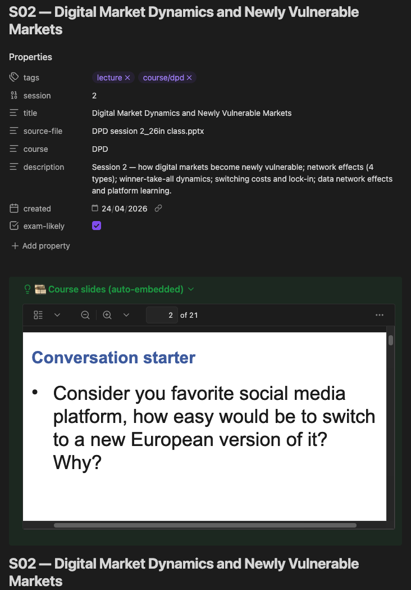

<div align="center">


# vaultcraft

**vaultcraft.**

[](LICENSE)
[](https://claude.com/claude-code)
[](https://obsidian.md)
[](CONTRIBUTING.md)

A [Claude Code](https://claude.com/claude-code) agent that turns lecture slides, lab notebooks, and textbook PDFs into a navigable, exam-ready [Obsidian](https://obsidian.md) knowledge vault - with hover-visible definitions, ELI5 analogies, comparison tables, and spaced-repetition flashcards.

[Quick start](#installation) · [How to use](#how-to-use) · [Examples](docs/examples.md) · [Conventions](docs/conventions.md) · [Contributing](CONTRIBUTING.md)

</div>

---

## Why this exists

Most students take notes as they go. By exam season, those notes are scattered across PDFs, Notion pages, Google Docs, and handwritten pages. The information is *there* - it's just not retrievable under stress.

This agent inverts the workflow: take the same source material everyone else has (slides, labs, readings, textbooks) and produce a knowledge graph optimised for recall. Hover over any wikilink → see the definition. Cmd+O → jump to any concept. Open the graph view → see how concepts cluster. Open `Tables.md` → recite the elevator pitch for every concept comparison the night before the oral exam.

The agent is subject-agnostic - it works for computer science, law, biology, finance, history, medicine, philosophy, anything you study. Concept names, comparison tables, and ELI5 analogies are drawn from whatever material you feed it.

---

## What it does

Point vaultcraft at a folder of course materials. It runs a seven-phase pipeline (plus one on-request phase):

1. **Intake.** Chip-style questions for subject, format, depth, language, deadline, sources, and output path. Nothing touches disk yet.
2. **Read.** Opens every PDF, PPTX, notebook, and markdown file in the source folder. Extracts concept names, formulas, code patterns, and section headings.
3. **Plan.** Proposes the folder layout and the full list of atomic notes to write. Waits for confirmation.
4. **Write atomic notes.** One concept per file, each opened by a `> [!definition]` callout so Obsidian shows the answer in hover preview without a click.
5. **Write lecture and lab sheets.** Per session: TL;DR callout, narrative following the slide order, eight to twelve potential exam questions across theory, comparison, application, critical-thinking categories.
6. **Embed source slides and PDFs** *(on request — say "add the slides" or "embed the PDFs"):* Copies original course materials into `<Course>/Slides/`, converts `.pptx` and `.docx` to PDF via LibreOffice, and inserts a `> [!example]+ 🎞️ Course slides (auto-embedded)` callout right after the frontmatter of each lecture note. Obsidian then renders the original slide deck inline above the typed summary — same workflow for problem-set solutions and paper readings.
7. **Cross-link and audit.** Generates wikilinks, builds `Tables.md` side-by-side comparisons with a "Say this" elevator-pitch column, configures `.obsidian/` (per-folder graph colours, Page Preview, callout styling), fixes orphan notes.

Typical run on a twelve-lecture course: about thirty minutes, ~150 atomic notes, ~3,000 wikilinks. Output is a working Obsidian vault you open and study from the same day.

> [!note]
> The illustrative names below (smoothing, attention, embeddings, backpropagation, Python labs) come from the author's NLP and machine-learning courses, used to show the structure. The agent is subject-agnostic. Point it at law cases, anatomy, microeconomics, or medieval history and you get the same kind of vault, populated from your material.

---

## Example output

The screenshots below show the author's own vault - built from four CS courses (NLP, machine learning, predictive analytics, digital platforms) - purely to illustrate what the agent produces. Your vault will look structurally similar but populated with whatever subject you feed it.

The Obsidian graph view of the four-course vault:


**What you're looking at:**
- Each colour cluster is one course (path-based colouring - no tag pollution)
- ~640 atomic notes across 4 courses, ~4,700 wikilinks holding them together
- Red dots: cross-course bridge notes in `_Shared/` connecting concepts across courses (e.g., *AIC/BIC* shared between PA and ML)
- White dots: lecture / lab study sheets - they sit at the centre of each course's concept cluster because every concept they introduce links back to them
- Smaller dots on the periphery: leaf concepts (definitions, formulas) referenced once or twice
- Larger dots in the middle of clusters: hub concepts (e.g., *Transformer*, *ARIMA*, *Logistic Regression*) referenced from many other notes

This is what semantic structure *looks like* - clusters emerge naturally from how concepts are wikilinked, not from any manual layout.

### Tables.md - the oral-exam cheatsheet

Every vault gets a `Tables.md` at root with comparison tables for the major dimensions of the course. Each row has a **"Say this"** column - a one-sentence elevator pitch you can recite verbatim during an oral exam.


Read the *"Say this"* column the night before an exam, and you have a confident opening sentence for any question about that comparison.

### Source slides embedded inline (Phase 6, on request)

Ask vaultcraft to *"add the slides"* or *"embed the PDFs"* and Phase 6 kicks in. The agent copies the original course materials into `<Course>/Slides/`, converts any `.pptx` or `.docx` to PDF via LibreOffice, and drops an auto-embedded callout right after the lecture-note frontmatter:



**What you're looking at:**
- The **Properties block** (Obsidian frontmatter UI) shows the standard lecture metadata plus `source-file:` pointing back to the original `.pptx` for traceability
- The collapsible `> [!example]+ 🎞️ Course slides (auto-embedded)` callout renders the converted PDF using Obsidian's native viewer — page 2 of 21 here, with the lecturer's "Conversation starter" prompt readable inline
- The typed lecture summary (TL;DR, narrative sections, exam questions) continues below the embed, so you read your notes and the original deck in the same scroll

Same workflow applies to problem-set solutions and paper readings — the agent embeds them in `Examples/` and `Readings/` notes via `> [!example]+ 📄 Solution PDF` and `> [!example]+ 📄 Full paper (PDF)` callouts.

After running on a typical single course (12 lectures + 9 labs):

```
my-course/
├── 00 - Start Here.md               ← entry MOC
├── Tables.md                         ← oral-exam comparison tables
├── Lectures/   12 study sheets        ← TL;DR + narrative + exam Qs
├── Concepts/  ~150 atomic notes       ← hover-friendly definitions
└── Labs/        9 Python walkthroughs
```

Each concept note has:
- 1-sentence definition (hover preview shows it without clicking)
- Intuition (plain English)
- Worked numerical example
- "Simple explanation (ELI5)" - analogy with everyday objects
- Wikilinks to related concepts
- Flashcards for spaced repetition

See [`docs/examples.md`](docs/examples.md) for sample notes.

---

## Installation

### Prerequisites

You need two things connected before vaultcraft will work:

1. **[Claude Code](https://claude.com/claude-code)** installed and signed in (terminal version recommended - the agent prints status banners and progress lines that read better in a terminal than in the desktop chat UI).
2. **An Obsidian MCP server** connected to Claude Code (terminal). The agent talks to your vault through this server: opens notes, runs Obsidian commands, validates wikilinks, refreshes the graph view. Without it, the agent can still write `.md` files to disk but cannot interact with the live vault.

   Common options: [`mcp-obsidian`](https://github.com/MarkusPfundstein/mcp-obsidian), [`smithery/obsidian`](https://smithery.ai). Pick one, add it via `claude mcp add ...`, restart Claude Code, then verify with `claude mcp list` - the server should show as connected.

   On the Obsidian side, install the **Local REST API** plugin and copy the API key into your MCP server config. See [`docs/installation.md`](docs/installation.md) for the full step-by-step.

### Install the agent

```bash
# 1. Clone this repo
git clone https://github.com/MikolajSapek/vaultcraft.git
cd vaultcraft

# 2. Run the installer
./install.sh                 # install agent + skills + templates
./install.sh --demo          # install + show how to run the bundled NLP demo
./install.sh --uninstall     # remove vaultcraft from ~/.claude/
```

The installer copies the agent to `~/.claude/agents/`, bundled skills to `~/.claude/skills/`, and templates to `~/Documents/ObsidianVaults/_templates/`. You can also do this manually if you prefer:

```bash
mkdir -p ~/.claude/agents && cp agents/vaultcraft.md ~/.claude/agents/
mkdir -p ~/.claude/skills && cp -R skills/obsidian-* ~/.claude/skills/
```

### Try the demo (60 seconds)

Want to see what vaultcraft produces before pointing it at your real coursework?

```bash
./install.sh --demo
```

This installs the agent and shows you exactly what to paste into Claude Code to build a small NLP vault from three bundled lecture stubs (`examples/demo-materials/`). The output lands at `~/Documents/ObsidianVaults/vaultcraft-demo/` - open it in Obsidian to see linked concept notes, hover-visible definitions, exam questions, and a populated graph view.

The agent is now available to Claude Code. Invoke it like:

```
> I have lecture slides for my NLP course in ~/Downloads/.
> Build me an exam-ready Obsidian vault at ~/Documents/ObsidianVaults/NLP/.
```

Claude Code will recognise the task and spawn the `vaultcraft` sub-agent. You'll know it's alive when it prints its banner.

See [`docs/installation.md`](docs/installation.md) for full setup including Obsidian plugin recommendations and skill installation. New to vaultcraft? Check [`docs/faq.md`](docs/faq.md) first.

---

## How to use

The agent always runs **Phase 1 - Intake** first, asking eleven quick questions before touching any files. The first one - *what kind of vault is this?* - is the most load-bearing; the rest of the agent's behaviour adapts to the answer. Answer them all, the agent restates the plan, you confirm, and it runs.

### Intake form

**Context** - what kind of vault and what it's for

| # | Field | Expected answer |
|---|---|---|
| 1 | Vault type | **`studies`** · `work` · `personal` · `research` · `reference` · `teaching` (see [docs/vault-types.md](docs/vault-types.md)) |
| 2 | Name | Course name · project name · topic - used in titles and frontmatter |
| 3 | Goal | What the vault is FOR - exam prep · onboarding doc · lit review · runbook · etc. |
| 4 | Priority topics | Must-know vs. nice-to-have |

**Deadline** - only required for `studies` and time-bound projects

| # | Field | Expected answer |
|---|---|---|
| 5 | Output target / deadline | Exam date · release date · submission · "no rush" |

**Format** - how the agent should write

| # | Field | Expected answer |
|---|---|---|
| 6 | Format preference | **Concise** (300–700w, scannable) · **Narrative** (1,200–2,500w, story-style) · **Reference** (terse, code-heavy) |
| 7 | Depth | **lean** (~40% cheaper) · **standard** (default) · **thorough** |
| 8 | Explanation styles | Pick 1–3: `eli5` · `technical-analogy` · `historical` · `counter-example` · `visual-metaphor` · `real-world-application` · `devils-advocate` · `worked-example` (see [Principle 19 in the agent](agents/vaultcraft.md)) |

**Inputs and outputs** - paths the agent should work with

| # | Field | Expected answer |
|---|---|---|
| 9 | Vault path | Where to build the vault, e.g. `~/Documents/ObsidianVaults/my-vault/` |
| 10 | Source files | Paths to PDFs · PPTX · .py · .ipynb · textbook excerpts · web URLs · pasted text |
| 11 | Language | English (default) · Polish · mixed |

### Typical run time

| Course size | Time on Sonnet | Time on Haiku |
|---|---|---|
| Light (5–7 lectures, no labs) | ~15 min | ~8 min |
| Standard (10–12 lectures + labs) | 30–60 min | 15–30 min |
| Heavy (16+ lectures + many labs) | 60–120 min | 30–60 min |

The agent uses **3-tier model routing** - Haiku for mechanical writing, Sonnet for synthesis, Opus only for hard reasoning (novel ELI5 analogies, ambiguous concept extraction). Full decision flow lives in Principle 18 of [`agents/vaultcraft.md`](agents/vaultcraft.md).

See [`docs/usage.md`](docs/usage.md) for example prompts and full workflow.

---

## What's in this repo

```
vaultcraft/
├── agents/
│   └── vaultcraft.md   ← The agent definition
├── skills/                      ← Obsidian skills the agent uses
│   ├── obsidian-markdown/
│   ├── obsidian-bases/
│   ├── obsidian-cli/
│   ├── json-canvas/
│   └── README.md
├── docs/
│   ├── installation.md          ← Detailed setup
│   ├── usage.md                  ← Example invocations
│   ├── conventions.md            ← Vault structure spec
│   └── examples.md               ← Sample concept / lecture notes
├── templates/
│   ├── concept.md                ← Atomic concept template
│   ├── lecture.md                ← Lecture study sheet template
│   ├── lab.md                    ← Lab study sheet template
│   └── bridge.md                 ← Cross-course bridge template
├── examples/screenshots/         ← Graph view example image
├── .github/                      ← Banner, issue templates, CI workflow
├── README.md                     ← This file
├── CONTRIBUTING.md
└── LICENSE                       ← MIT
```

---

## Skills the agent uses

The agent calls Claude Code skills to handle Obsidian-specific syntax and supplementary research. Four are bundled in `skills/`; six others are optional and the agent gracefully falls back if they're missing.

### Bundled (recommended install - copy to `~/.claude/skills/`)

| Skill | Purpose | When the agent invokes it |
|---|---|---|
| `obsidian-markdown` | Valid Obsidian Flavored Markdown - wikilinks, embeds, callouts, properties, frontmatter | Any time the agent writes a note (avoids syntax mistakes) |
| `obsidian-bases` | Generate `.base` files (Obsidian Bases - filterable database views) | Phase 8, when building the optional Study Dashboard |
| `obsidian-cli` | Bulk vault operations (rename, move, link verification) | Optional, used when doing >20 file operations in one pass |
| `json-canvas` | Generate `.canvas` JSON Canvas files (visual concept maps) | Phase 7, optional Course Map |

### Optional (not bundled - install separately if you want full functionality)

| Skill | Purpose | When the agent invokes it |
|---|---|---|
| `defuddle` | Clean markdown extraction from web pages | Phase 2, when supplementary web research has noisy HTML (ads, nav, comments) |
| `deep-research` | Multi-source research with synthesis (firecrawl + exa MCPs) | Phase 2, when a concept is under-explained in slides and needs >2 sources |
| `exa-search` | Neural search via Exa MCP | Phase 2, when finding a specific paper or reference implementation |
| `docs` | Context7 documentation lookup for libraries | Phase 5, when generating lab notes that use unfamiliar libraries (verifies API signatures) |
| `iterative-retrieval` | Progressive context retrieval for very long PDFs | Phase 2, only for >100-page PDFs |
| `context-engineering` | Meta-skill for agent context optimisation | Rare - only if the agent thrashes on setup |

**The agent works without any of these skills.** Skills speed things up and reduce mistakes; they are not strict dependencies. See [`skills/README.md`](skills/README.md) for full install instructions and fallback behaviour.

---

## The crafting pipeline

vaultcraft thinks of vault generation as a Minecraft-style crafting workflow. Internally the agent runs ten numbered phases - here's the themed map of what each one does:

| Phase | Themed name | What it does |
|---|---|---|
| 0 | 🗺 **Site survey** | Detect whether you're starting a new vault, adding to one, or resuming an unfinished build |
| 1 | 📜 **Recipe selection** | Ask 9 intake questions: course, exam format, depth, sources, language |
| 1.5 | ⚖️ **Budget & blueprint** | Estimate tool budget and write `.vault-progress.md` so runs are resumable |
| 2 | ⛏ **Mining** | Read every PDF/PPTX/notebook and extract the full inventory of named concepts |
| 2.5 | 🏗 **Foundation** | Bootstrap `.obsidian/` config - graph colours, hotkeys, CSS, plugin recommendations |
| 3 | 🧱 **Layout** | Plan and propose the folder structure |
| 4 | 💎 **Forging concepts** | Generate atomic concept notes - one crystal per concept, all linked |
| 5 | 📚 **Crafting study sheets** | Build per-lecture and per-lab notes that link back to concept crystals |
| 6 | 🪟 **Window into source** *(on request)* | Embed original slides, PDFs, and paper sources inline in lecture and reading notes - converts `.pptx` / `.docx` to PDF via LibreOffice so Obsidian renders them natively |
| 7 | 🗺 **Cartography** *(low priority)* | Optional JSON Canvas course map |
| 8 | 🧭 **Hub & beacon** | Build the entry MOC + `Tables.md` for oral exams |
| 9 | 🔎 **Inspection** | Quality pass: broken links, depth check, orphans, hover-preview verification |

You don't need to know the phase names to use vaultcraft - but the agent announces each one as it runs so you always know what's happening.

---

## Conventions baked into the agent

The agent enforces these conventions across every vault it builds:

- **Atomic notes** - one concept per file, never two.
- **Hover-visible definitions** - definition callout is the FIRST content after the H1, so Obsidian's hover preview shows it without clicking.
- **Worked examples mandatory** - every formula gets actual numbers; every theoretical concept gets a concrete scenario.
- **ELI5 for hard concepts** - math-heavy and abstract concepts get a *"Simple explanation (ELI5)"* section with an everyday-object analogy.
- **Wikilinks not hashtags** - topical clustering happens via `[[wikilinks]]`. Tags are folder-level classifiers only (`concept`, `lecture`, `lab`, `moc`).
- **Path-based graph colours** - graph view is coloured by folder, not by tag, so it stays clean.
- **Comparison tables for oral exams** - `Tables.md` with "Say this" elevator-pitch column.
- **Token economy** - agent delegates mechanical writing (Phase 4 atomic notes, Phase 5 study sheets) to a sub-agent with `model: haiku` to save ~60% of tokens.

See [`docs/conventions.md`](docs/conventions.md) for the full spec.

---

## Limitations

- **Source quality matters.** If your slides are pure bullet-point outlines, the agent has less to extract. Detailed lecture decks produce better vaults.
- **PPTX requires LibreOffice** for conversion (`soffice --headless --convert-to pdf`) - install it for any vault that includes `.pptx` slides.
- **Claude Code only.** The agent is built for Claude Code's agent system. Porting to other agent frameworks would need rewriting the orchestration layer.
- **Math notation in PDF.** OCR on scanned slides loses LaTeX. Agent works best on natively-digital PDFs/PPTX.

---

## License

MIT - see [LICENSE](LICENSE).

---

## Contributing

Pull requests welcome - especially if you've used the agent on your own course and have improvements to suggest. Open an issue first to discuss large changes.

Built by students, for students. If this helps you nail an exam, that's the only thanks needed.
