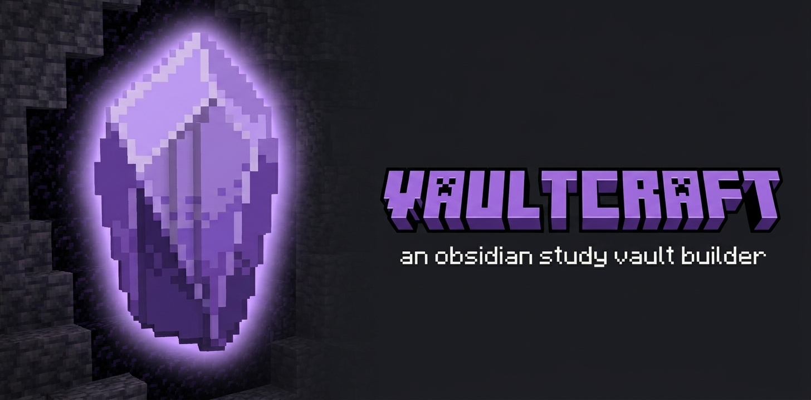
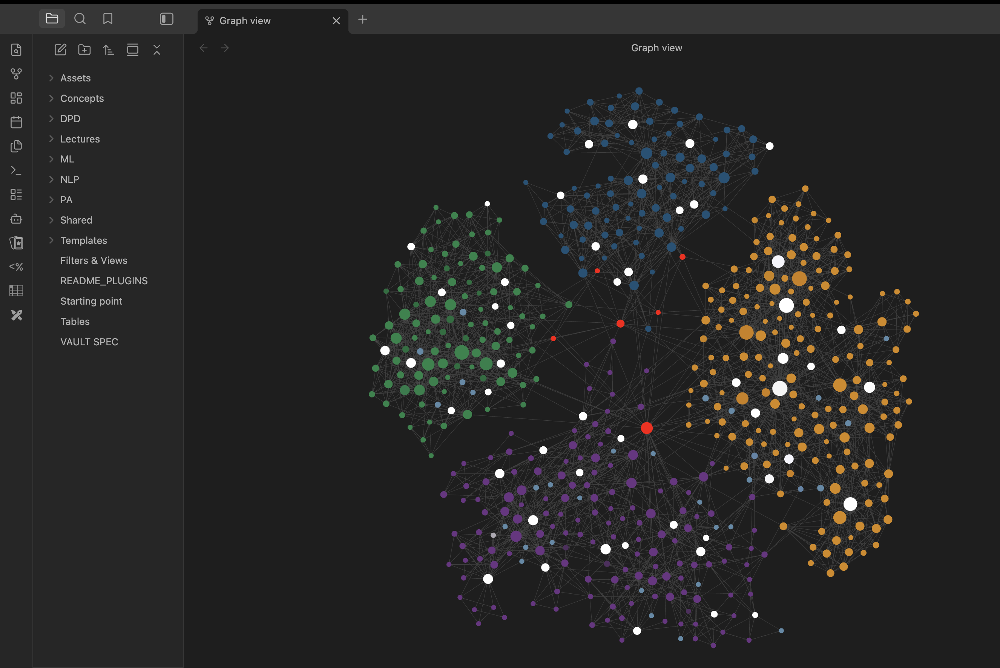
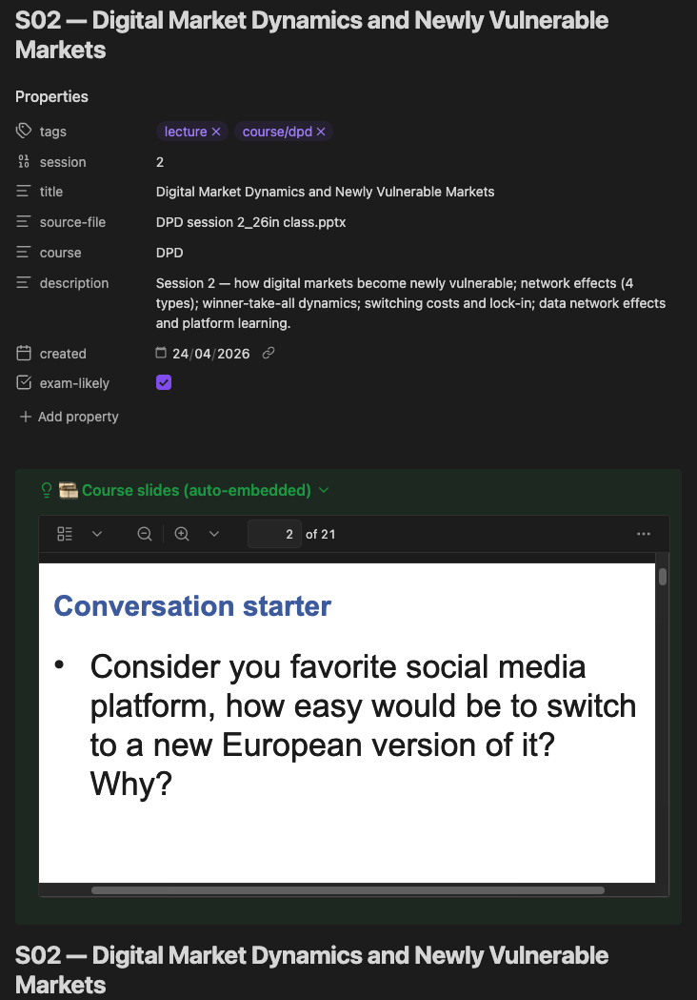

<div align="center">



# vaultcraft

**study · work · research**

[](LICENSE)
[](https://claude.com/claude-code)
[](https://obsidian.md)
[](CONTRIBUTING.md)

A [Claude Code](https://claude.com/claude-code) agent that turns any scattered materials — lecture slides, meeting notes, project docs, research papers — into a navigable, richly visual [Obsidian](https://obsidian.md) knowledge vault. Hover-visible definitions, embedded PDFs, extracted figures, ELI5 analogies, comparison tables, Kanban boards, stakeholder profiles, and spaced-repetition flashcards.

[Quick start](#installation) · [How to use](#how-to-use) · [Vault types](#vault-types) · [Examples](docs/examples.md) · [Conventions](docs/conventions.md) · [Roadmap](ROADMAP.md) · [Contributing](CONTRIBUTING.md)

</div>

---

## Why this exists

Most people take notes as they go. By the time you need them — before an exam, in a client meeting, writing a report — those notes are scattered across PDFs, Notion pages, Google Docs, and handwritten pages. The information is *there*; it just isn't retrievable under pressure.

This agent inverts the workflow: take the same source material you already have and produce a linked knowledge graph optimised for how you actually use it.

- **Students:** hover over any wikilink → see the definition. Open `Tables.md` → recite the elevator pitch for every concept comparison the night before an oral exam.
- **Professionals:** open the Kanban board → see active projects and open actions. Click a stakeholder → see their profile, meeting history, and stored documents in one note.
- **Researchers:** browse `Papers/` → every paper linked to the concepts it introduces, every concept linked back to the papers that define it.

The agent is subject-agnostic. Point it at law cases, anatomy, NLP slides, client briefings, or company research — the structure adapts to your vault type.

---

## What it does

Point vaultcraft at a folder of materials. It asks a few intake questions, then runs a ten-phase pipeline:

1. **Intake.** Chip-style questions for vault type, format, depth, language, deadline, sources, and output path. Nothing touches disk yet.
2. **Read and extract figures.** Opens every PDF, PPTX, notebook, and markdown file. Extracts concept names, formulas, code patterns, and section headings. For PDFs containing diagrams or charts, runs `pdfimages` to extract embedded figures, names them descriptively, and copies them to `Assets/` for inline use in notes.
3. **Plan.** Proposes the folder layout and the full list of notes to write. Waits for confirmation.
4. **Write atomic notes.** One concept per file, each opened by a `> [!definition]` callout so Obsidian shows the answer in hover preview without a click. Work vaults get Meeting, Company, Person, Decision, and Project templates instead.
5. **Write lecture / topic sheets.** Per session or topic: TL;DR callout, narrative, eight to twelve potential exam questions (studies) or action items and decisions (work).
6. **Embed source PDFs.** Automatically copies source materials into the vault, converts `.pptx` / `.docx` to PDF via LibreOffice, and inserts an inline callout in each note. Obsidian renders the original deck or document inline above your typed summary. Extracted figures embed at the relevant section of each note.
7. **Cartography** *(low priority).* Optional JSON Canvas concept map.
8. **Hub and dashboard.** Studies vaults: entry MOC + `Tables.md` for oral exams. Work vaults: Kanban board (`00 - Dashboard.md`) with active projects, open actions, and recent meetings via Dataview.
9. **Quality pass.** Broken links, bidirectional link audit (concept ↔ lecture), depth check, orphans, quality report (notes missing definition / example / flashcards).

Typical run on a twelve-lecture course: about thirty minutes, ~150 atomic notes, ~3,000 wikilinks. A work vault with 10 stakeholders and 20 meetings: ~45 minutes. Output is a working Obsidian vault you open the same day.

---

## Vault types

The first intake question — *what kind of vault is this?* — determines folder structure, note templates, plugins, graph colours, and dashboard style.

| Type | Built for | Key outputs |
|---|---|---|
| **`studies`** | Exam prep, course notes | Concept notes, lecture sheets, `Tables.md`, spaced-repetition flashcards, exam questions |
| **`work`** | Professional knowledge base | Kanban board, meeting notes, stakeholder profiles, decision log, project hubs, `Documents/` per person |
| **`research`** | Literature review, paper notes | Paper notes, concept notes, hypotheses, bibliography-compatible frontmatter |
| **`personal`** | Hobbies, life skills, curiosity | Topic notes, practice logs, ELI5 analogies, optional flashcards |
| **`reference`** | Technical docs, runbooks, API docs | Terse procedure notes, code-heavy, no analogies |
| **`teaching`** | Course prep | Lesson plans, concept notes with "How to introduce this" and "Common misconceptions" sections |

---

## Work vault

When you select `work`, the agent builds a professional knowledge base around people, projects, and decisions — not courses and lectures.

### Folder structure

```text
<VaultRoot>/
├── 00 - Dashboard.md          ← Kanban board + Dataview queries
├── Projects/                  ← one hub note per initiative
├── Meetings/                  ← YYYY-MM-DD meeting notes
├── Stakeholders/
│   ├── People/                ← contact profiles with interaction history
│   └── Companies/             ← organisation profiles
├── Decisions/                 ← decision log with options, rationale, review dates
├── Concepts/                  ← domain knowledge notes
├── Documents/
│   └── <person-or-project>/   ← PDFs embedded in the relevant profile
└── Assets/                    ← extracted figures, logos, diagrams
```

### Kanban dashboard

`00 - Dashboard.md` uses the obsidian-kanban plugin:

```text
🔴 Blocked  |  🟡 In progress  |  🟢 Done
```

Below the board, Dataview queries surface:

- Open action items across all meetings
- Active projects with their last update date
- Meetings from the past 14 days

### Stakeholder profiles

During intake, the agent asks for your key stakeholders by name and creates profile stubs for each one — so meetings and decisions can link to real people from day one.

Each person note:

```markdown
---
tags: [person]
company: [[Acme Corp]]
role: Head of Sustainability
status: active
---
# Jane Smith

> [!stakeholder] Role
> Jane is Head of Sustainability at [[Acme Corp]] — primary contact for the
> Q3 ESG reporting engagement.

## Documents
> [!example]+ 📄 Stored documents
> ![[Documents/jane-smith/contract-2026.pdf]]

## Interaction history
- [[Meeting — ESG scope kickoff (2026-05-14)]]
- [[Meeting — Data gap review (2026-06-03)]]
```

Source PDFs (contracts, reports, briefings) drop into `Documents/<person>/` and embed inline in the profile note.

### Work vault callout colours

| Callout | Colour | Use |
|---|---|---|
| `decision` | Blue | Recorded decisions with rationale |
| `action` | Orange | Open action items |
| `risk` | Red | Flagged risks or blockers |
| `meeting` | Teal | Meeting TL;DR in topic notes |
| `stakeholder` | Purple | Stakeholder role summary |

---

## Studies vault

The original vaultcraft context. Point it at lecture slides, lab notebooks, textbook chapters, or recorded transcripts and get an exam-ready knowledge graph.

### Folder structure

```text
<VaultRoot>/
├── Tables.md                  ← oral-exam comparison cheatsheet
├── MOC — <Course>.md          ← entry map of content
├── Lectures/                  ← one note per lecture/session
├── Labs/                      ← one note per lab
├── Concepts/                  ← atomic concept notes
├── Papers/                    ← paper notes (if research-heavy course)
├── _Shared/                   ← bridge notes across courses
└── Assets/                    ← extracted figures, diagrams
```

### Tables.md — the oral-exam cheatsheet

Every studies vault gets a `Tables.md` at root with comparison tables. Each row has a **"Say this"** column — a one-sentence elevator pitch you can recite verbatim.

### Studies callout colours

| Callout | Colour | Use |
|---|---|---|
| `definition` | Purple | Concept definition (shows in hover preview) |
| `example` | Blue | Worked example |
| `question` | Orange | Exam question |
| `important` | Red | Key caveat or gotcha |
| `exam` | Green | Examiner-facing summary |

---

## Example output

The screenshots below show the author's own vault — built from four CS courses (NLP, machine learning, predictive analytics, digital platforms) — purely to illustrate what the agent produces. Your vault will look structurally similar but populated with whatever subject you feed it.

The Obsidian graph view of the four-course vault:



**What you're looking at:**

- Each colour cluster is one course (path-based colouring — no tag pollution)
- ~640 atomic notes across 4 courses, ~4,700 wikilinks holding them together
- Red dots: cross-course bridge notes in `_Shared/` connecting concepts across courses
- White dots: lecture / lab study sheets at the centre of each cluster
- Larger dots: hub concepts referenced from many other notes

### Source slides and figures embedded inline

Phase 6 runs automatically. The agent copies source materials into the vault, converts `.pptx` / `.docx` to PDF, drops an inline callout in each lecture note, and embeds extracted figures at the relevant section:



**What you're looking at:**

- The `> [!example]+ 🎞️ Course slides` callout renders the converted PDF using Obsidian's native viewer
- An extracted figure (`![[Assets/ML-L08-fig12-relu-vs-sigmoid.png|600]]`) embedded inline at the activation-functions section
- The typed lecture summary continues below — notes and original deck in the same scroll

---

## Installation

### Prerequisites

1. **[Claude Code](https://claude.com/claude-code)** installed and signed in.
2. **An Obsidian MCP server** connected to Claude Code. The agent talks to your vault through this server. Common options: [`mcp-obsidian`](https://github.com/MarkusPfundstein/mcp-obsidian), [`smithery/obsidian`](https://smithery.ai). Add via `claude mcp add ...`, restart Claude Code, verify with `claude mcp list`.

   On the Obsidian side, install the **Local REST API** plugin and copy the API key into your MCP server config. See [`docs/installation.md`](docs/installation.md) for the full step-by-step.

3. **poppler** (for figure extraction from PDFs): `brew install poppler`. Optional but recommended — without it, figures stay inside PDFs and don't embed inline.

4. **LibreOffice** (for PPTX/DOCX → PDF conversion): `brew install --cask libreoffice`. Optional — without it, `.pptx` files can't be embedded inline.

### Install the agent

```bash
# 1. Clone this repo
git clone https://github.com/MikolajSapek/vaultcraft.git
cd vaultcraft

# 2. Run the installer
./install.sh                 # install agent + skills + templates
./install.sh --demo          # install + show how to run the bundled NLP demo
./install.sh --uninstall     # remove vaultcraft from ~/.claude/
```

The installer copies the agent to `~/.claude/agents/`, bundled skills to `~/.claude/skills/`, and templates to `~/Documents/ObsidianVaults/_templates/`.

### Try the demo (60 seconds)

```bash
./install.sh --demo
```

This installs the agent and shows you exactly what to paste into Claude Code to build a small NLP vault from three bundled lecture stubs. Output lands at `~/Documents/ObsidianVaults/vaultcraft-demo/`.

---

## How to use

The agent always runs **Phase 1 - Intake** first, asking questions before touching any files. The first one — *what kind of vault is this?* — is the most load-bearing; everything else adapts to the answer.

### Intake form

**Batch A — vault shape**

| # | Field | Expected answer |
|---|---|---|
| 1 | Vault type | `studies` · `work` · `research` · `personal` · `reference` · `teaching` |
| 2 | Format | Detailed narrative (default) · Study sheet · Reference |
| 3 | Depth | lean · **standard** · thorough |
| 4 | Language | **English** · Polish · German · Spanish |

**Batch B — style preferences**

| # | Field | Expected answer |
|---|---|---|
| 5 | Explanation styles | `eli5` · `technical-analogy` · `historical` · `counter-example` · `real-world-application` · `devils-advocate` · `worked-example` |
| 6 | Flashcards | None (default) · Key concepts only · Every concept |
| 7 | Urgency | Studies: exam date. Work: weekly / monthly / quarterly cadence. |

**Batch C — free text**

```text
1. Course / project / team name?
2. Specific goal? (e.g. "exam 28 June", "client onboarding by Q3")
3. Priority topics?
4. Deadline / target date?
5. Vault path?
6. Input sources? (file paths, URLs, pasted text)
```

For work vaults, Batch C also asks: *"List your key stakeholders (names / companies) — I'll create their profiles now."*

### Typical run time

| Vault | Time on Sonnet |
|---|---|
| Studies — 12 lectures + labs | 30–60 min |
| Work — 10 stakeholders, 20 meetings | ~45 min |
| Research — 20 papers | ~40 min |

The agent uses **3-tier model routing** — Haiku for mechanical writing, Sonnet for synthesis, Opus only for hard reasoning. Full decision flow in [Principle 18 of the agent](agents/vaultcraft.md).

---

## The crafting pipeline

| Phase | Themed name | What it does |
|---|---|---|
| 0 | 🗺 **Site survey** | Detect: new vault / incremental update / resume unfinished build |
| 1 | 📜 **Recipe selection** | Intake questions: vault type, format, depth, stakeholders, sources |
| 1.5 | ⚖️ **Budget and blueprint** | Estimate tool budget, write `.vault-progress.md` for resumable runs |
| 2 | ⛏ **Mining** | Read every PDF/PPTX/notebook. Extract concepts. Run `pdfimages` to pull figures from PDFs, name them descriptively, copy to `Assets/` |
| 2.5 | 🏗 **Foundation** | Bootstrap `.obsidian/` config — vault-type-specific graph colours, CSS callouts, plugin list |
| 3 | 🧱 **Layout** | Plan and propose the folder structure |
| 4 | 💎 **Forging notes** | Studies: atomic concept notes. Work: Meeting / Company / Person / Decision / Project templates |
| 5 | 📚 **Crafting sheets** | Studies: per-lecture notes with exam questions. Work: topic and meeting summaries |
| 6 | 🪟 **Window into source** | Automatically embeds PDFs and extracted figures inline in every note |
| 7 | 🗺 **Cartography** *(low priority)* | Optional JSON Canvas concept map |
| 8 | 🧭 **Hub and beacon** | Studies: MOC + `Tables.md`. Work: Kanban board + Dataview dashboard |
| 9 | 🔎 **Inspection** | Broken links · bidirectional link audit · orphan check · quality report |

---

## What's in this repo

```text
vaultcraft/
├── agents/
│   └── vaultcraft.md            ← The agent definition
├── skills/                      ← Obsidian skills the agent uses
│   ├── obsidian-markdown/
│   ├── obsidian-bases/
│   ├── obsidian-cli/
│   ├── json-canvas/
│   └── README.md
├── docs/
│   ├── installation.md
│   ├── usage.md
│   ├── vault-types.md
│   ├── conventions.md
│   ├── examples.md
│   └── codex-maintenance.md
├── templates/
│   ├── concept.md               ← Atomic concept template (studies)
│   ├── lecture.md               ← Lecture study sheet template
│   ├── lecture-golden.md        ← Golden Template lecture note (CBS standard)
│   ├── lab.md                   ← Lab study sheet template
│   └── bridge.md                ← Cross-course bridge template
├── examples/screenshots/
├── .github/
├── README.md
├── ROADMAP.md
├── SECURITY.md
├── CONTRIBUTING.md
└── LICENSE
```

---

## Conventions baked into the agent

- **Atomic notes** — one concept (or one meeting, or one person) per file.
- **Hover-visible definitions** — definition callout is the FIRST content after H1; Obsidian's hover preview shows it without clicking.
- **Worked examples mandatory** — every formula gets actual numbers; every theoretical concept gets a concrete scenario.
- **ELI5 for hard concepts** — math-heavy and abstract concepts get a *"Simple explanation (ELI5)"* section.
- **Wikilinks not hashtags** — topical clustering via `[[wikilinks]]`; tags are folder-level classifiers only.
- **Path-based graph colours** — different palettes for studies / work / research vaults; no tag pollution.
- **Figure extraction** — `pdfimages` pulls figures from source PDFs, names them descriptively, embeds them inline.
- **PDF embedding** — source slides and documents embed inline in every lecture or topic note automatically.
- **Bidirectional link audit** — Phase 9 verifies that concept → source lecture and lecture → concept list are mutually consistent.
- **Quality report** — after every run: count of notes missing definition / example / flashcards, status breakdown, difficulty distribution.
- **Token economy** — mechanical writing delegated to Haiku (~60% token savings); synthesis on Sonnet; hard reasoning on Opus.

See [`docs/conventions.md`](docs/conventions.md) for the full spec.

---

## Maintainer workflow

vaultcraft is maintained with a Codex-assisted workflow for reviewing agent prompt changes, checking installer safety, improving documentation, generating synthetic test fixtures, and validating generated Obsidian vault quality.

Codex is used as a review and maintenance tool, not an automatic committer. Every AI-assisted change is manually reviewed before merge, and private vault contents, source materials, API keys, and local usernames must never be committed.

- Roadmap: [`ROADMAP.md`](ROADMAP.md)
- Security policy: [`SECURITY.md`](SECURITY.md)
- Codex-assisted maintenance notes: [`docs/codex-maintenance.md`](docs/codex-maintenance.md)

---

## Limitations

- **Source quality matters.** Pure bullet-point slides produce thinner vaults than detailed lecture decks.
- **PPTX requires LibreOffice** for conversion — `brew install --cask libreoffice`.
- **Figure extraction requires poppler** — `brew install poppler`. Without it, figures stay inside PDFs.
- **Claude Code only.** The agent is built for Claude Code's agent system.
- **Math notation in scanned PDFs.** OCR on scanned slides loses LaTeX. Works best on natively-digital PDFs/PPTX.

---

## License

MIT — see [LICENSE](LICENSE).

---

## Contributing

Pull requests welcome — especially if you've used the agent on your own course or project and have improvements to suggest. Open an issue first to discuss large changes.

Built for students, professionals, and researchers who want their knowledge to be retrievable when it matters.
