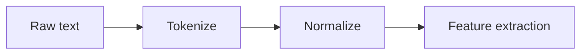

# L0X - Lecture Title

> [!tldr] TL;DR (30 seconds)
> - Key insight 1 - one line
> - Key insight 2 - one line
> - Key insight 3 - one line
> - Key insight 4 - one line
> - Key insight 5 - one line

---

## Topic Section 1

> [!definition] In one line
> **Concept** - one-sentence definition.

**Intuition.** 1–2 paragraphs of plain-language explanation. Why was this technique invented? What problem does it solve? 80–150 words.

**Formal detail.** 1 paragraph + formula if applicable. Explain each symbol. Walk through any derivation. 80–120 words.

**Worked example.** Concrete numerical OR code example with actual values. Show the computation. For math-heavy lectures this is essential. 100–200 words.

**Why it matters / when to use.** 1 paragraph on practical relevance and alternatives. 60–100 words.

**Gotcha.** 1–3 bullets of pitfalls and common mistakes.

→ See [[Concept Note]] for derivation depth.

---

## Topic Section 2

(Same pattern.)

For comparisons, use a table:

| Method | Splits on | Pros | Cons |
|---|---|---|---|
| Whitespace | spaces | simple | loses punctuation |
| WordPiece | subwords | handles OOV | slower |
| BPE | frequent pairs | used in GPT | training required |

For pipelines/hierarchies, use Mermaid:

---

## Key takeaways

1. Crisp insight - one line
2. Crisp insight - one line
3. Crisp insight - one line
4. Crisp insight - one line

## Concepts introduced

- [[Concept A]] - one-line reminder
- [[Concept B]] - one-line reminder
- [[Concept C]] - one-line reminder

## Potential Exam Questions

### Theory / Definitions

1. **What is X?** - One-line answer pointer with [[wikilink]].
2. **Define Y in 2 sentences.** - Pointer.
3. **State the assumption Z relies on.** - Pointer.

### Understanding / Comparison

4. **Compare X and Y.** - Pointer with [[wikilinks]].
5. **Why does Z fail when …?** - Pointer.

### Application / Worked problem

6. **Compute X for the following …** - Pointer.
7. **Frame this real-world task as Y.** - Pointer.

### Critical thinking

8. **Argue for or against Z's claim.** - Pointer.
9. **What are the limitations of X in setting Y?** - Pointer.

## Sources

- Slides: `lectureXX.pdf`
- Lab: [[Lab 0X - Title]]
- Author / lecturer
